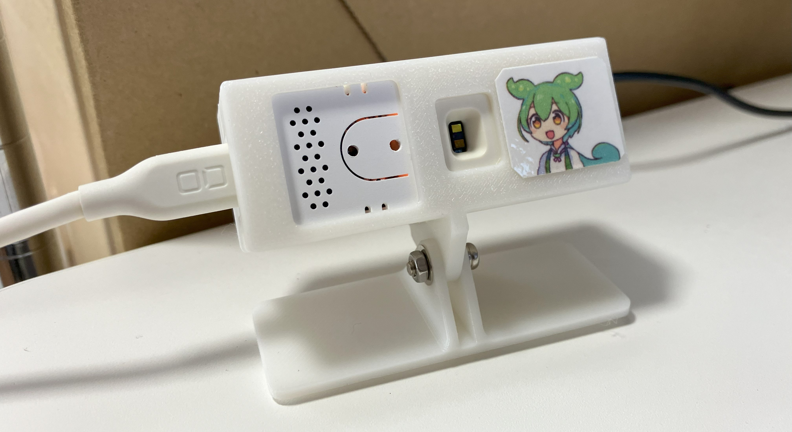

# 30分以上PCに向かっているとずんだもんが休憩を促すデバイス for M5Stack ATOM-ECHO



## これは何？
一定時間PCの画面の前にいたら、休憩を促すメッセージを再生するデバイスです。PCの画面に長時間向かっていると目に負担がかかるので、目を休めつつ、気分転換を図るのが狙いです。

## 必要なハードウェア
* M5Stack [ATOM ECHO](https://shop.m5stack.com/products/atom-echo-smart-speaker-dev-kit)
* M5Stack [Unit-ToF4M](https://shop.m5stack.com/products/time-of-flight-distance-unit-vl53l1x) 
（max 2mタイプの方は動作未確認）

## しくみ
ToFセンサーを使って対象物（人間）までの距離を測定します。指定した範囲内に人が存在する場合、PCの前にいると判断します。PCの前にいる時間が一定時間を超えると働きすぎと判断して、休憩を促すメッセージを再生します。

物体を検出するセンサーとしてはPIRセンサーが有名ですが、PIRセンサーでは距離が測れないため、PCの前にいるのか、離れた場所にいるのかを区別できません。また検知する角度も広いので他の人にも反応してしまいます。今回使用したUnit-ToF4Mは検知する範囲の角度が狭いので、人間くらいの大きさならピンポイントで測定できます。

## LEDの光り方
ATOM ECHOのLEDはPCの前にいる時間が長くなると、緑から赤へと徐々に変化していきます。疲れが蓄積していくイメージです。休憩するとまた緑に戻ります。

## カスタマイズ
```cpp:zundabreak.ino
// 動作設定
const uint32_t WORK_LIMIT = 1800;       // 30分以上働いたら休憩を促す(s)
const uint32_t BREAK_TIME_LONG = 90;    // 休憩の長さ(s)
const int DISPLAY_DISTANCE_MIN = 400;   // PCの前にいると判断する位置 MIN (mm)
const int DISPLAY_DISTANCE_MAX = 800;   // PCの前にいると判断する位置 MAX (mm)
```
上記の値を変えることで、休憩を促すまでの時間、休憩時間を設定できます。単位は秒です。また、PCの前にいると判断する距離もミリ単位で設定できます。

## 一体型ケースの作成
stl/ フォルダの中にSTLファイルが入ってます。ほかにΦ3mmのネジやナットなどが必要です。

## オリジナル音声の作り方
音声は3種類あります。
* 起動時の音声「がんばるのだ」
* 休憩時間を知らせる音声「ちょっと休憩するのだ」
* 休憩終了を知らせる音声「そろそろいいのだ」

オリジナル音声に差し替えたい場合は、WAVファイルを作成して、ソースコードの形式に変換します。
```
python file2h.py input.wav output.h
```
これをsound.hにコピペして変数名のところを変更すればOKです。サンプリングレートはSAMPLE_RATEで設定します。

## デバッグモード
電源投入時にボタンを押したまま起動すると、デバッグモードに入ります。シリアルコンソールに距離が出力されるので、これを参考にDISPLAY_DISTANCE_MIN/MAXを調整します。また、範囲内にいるときはLEDが赤になるので、PCの前にいるときだけ反応するかチェックしてみてください。

